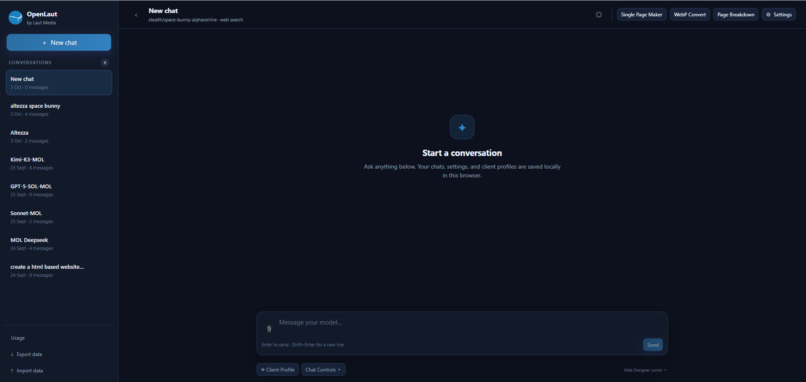

# OpenLaut by Laut Media

A dashboard for AI web designers, by AI web designers.

OpenLaut was born from frustration. As web designers working with AI chat tools, we kept hitting the same walls: token limits that cut us off mid-project, even on paid plans, leaving us waiting hours or until the next day. Trying other models meant limited free versions or yet another subscription. And we had very little control over how we worked.

OpenLaut solves this. It is a dashboard built for AI web designers, by AI web designers. It uses OpenRouter as the gateway to many different models, with full control over how much you spend. Just add your API key and you are ready to go.

WebP converter, built in. Converting an image to WebP used to mean leaving your chat, using another site, and uploading the result back. OpenLaut has a WebP converter inside the app, so you never have to leave the window.

Page Breakdown. One of the most frustrating parts of AI web editing is pinpointing the exact element in an HTML draft that you want changed. With Page Breakdown, you can see the structure of generated HTML, select the exact element, send it to the chat, and explain what you want. No more long chains of revisions and guesswork.

Single Page Maker. Client briefs are almost always templates, but editing a prompt template by hand is slow. With Single Page Maker, you fill in as much detail from the client brief as you like, add images as links or embed them as base64, and OpenLaut generates the complete brief to send straight to your model to build the HTML website. It can save up to an hour per project.

## Features

- **AI Profiles** — separate named profiles, each with its own model and System Prompt.
- **Model IDs** — pick from a curated list of models, or add your own model ID.
- **Client Profile** — keep client-specific facts and brand values separate from your global About me note.
- **Code block actions** — Copy, Preview, Page Breakdown, and Download HTML on every HTML code block.
- **Page Breakdown** — read generated HTML as a tree of Sections, Columns, Groups, and Elements; select an exact block and send it to the chat with one click.
- **Page Breakdown preview** — view the real rendered page with colour-coded overlay boxes, on a Mobile (390px) or Desktop (1280px) viewport.
- **Single Page Maker** — a guided brief across ten categories (Business Basics, Story & Message, Services or Products, Audience & Goal, Visual Direction, Trust & Social Proof, Extras, Optimization, Page Structure, Images) that generates a complete brief to send to your model.
- **Images in the brief** — add images as links or embed them as base64, with copy-to-new-chat attachments.
- **WebP Convert** — convert images to WebP inside the app, then Add to chat or Add to Library.
- **Media Library** — store images and HTML files, with Images and HTML files tabs, rename, delete, add to chat, and multi-select delete.
- **Attachments** — upload from your device or open the Media Library from the paperclip.
- **Usage** — track requests, input and output tokens, and cost, grouped by day, week, month, model, or profile. Export usage CSV.
- **Chat cost** — see the running cost of the current chat, with a token breakdown on hover.
- **Export data / Import data** — back up your chats and settings, and merge an export on another device. Your API key is never included in exported files.
- **Clear Everything** — permanently remove all local data, including your API key.

## How to Use

Open `index.html` in Chrome, or use the hosted version at https://lautmedia.com/openlaut-web/

Then open **Settings**, paste your OpenRouter API key, pick a model, and start chatting.

Note that data is stored per browser and per address. The file you open from disk and the hosted page do not share data, because they are treated as two separate origins by the browser.

## Security and Privacy

All data, including chats, settings, files, and your API key in localStorage, is stored in the user's own browser. There is no server. This version contains no analytics or trackers. The only network requests go directly to openrouter.ai, whose privacy policy applies.

Chrome is recommended, because some browsers such as Safari may restrict or clear stored site data.

Use **Clear Everything** in Settings to remove all local data.

## Contributing

Issues and pull requests are welcome.

Forks must follow [TRADEMARK.md](TRADEMARK.md).

## Credits

- Mo Takovic - Developer - https://takovic.com

## License

MIT (code only). The OpenLaut name and logo are not covered by the MIT License, see [TRADEMARK.md](TRADEMARK.md).

## Like the Idea?

I made this so everyone who may have a frustration like I did, it solved my problem, hopefully it solves yours. If you feel like I deserve a coffee, you can always https://buymeacoffee.com/takovic

Cheers!
